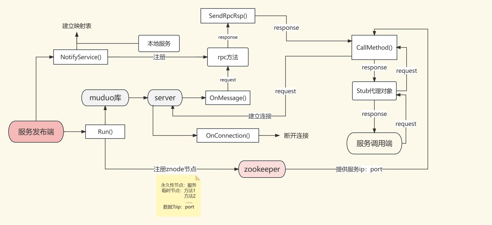

# mprpc

mprpc是一个c++分布式网络通信框架，负责解决在分布式服务部署中 消息的序列与反序列化、网络包的收发等问题，可以让使用者专注于业务，快速实现微服务的分布式部署


### 主要功能

**服务发布端**：支持将本地服务注册到rpc节点上并启动该服务，等待远程的rpc调用；支持执行回调操作，完成响应对象数据的序列化和网络发送

**服务调用端**：支持调用服务发布端的某已注册的服务，并接收发布端返回的响应数据

**日志功能**：支持分级设置日志级别，方便调试


### 整体架构


**muduo库**：负责数据流的网络通信

**protobuf**：负责rpc方法的注册，数据的序列化和反序列化

**zookeeper**：负责分布式环境的服务注册，记录服务所在的ip地址以及port端口号


###  使用方法

**服务发布端**

```c++
class UserService : public fixbug::UserServiceRpc // 使用在rpc服务发布端（rpc服务提供者）
{
public:
    bool Login(std::string name, std::string pwd)
    {
        std::cout << "doing local service: Login" << std::endl;
        std::cout << "name:" << name << " pwd:" << pwd << std::endl;  
        return true;
    }
    /*
    重写基类UserServiceRpc的虚函数 下面这些方法都是框架直接调用的
    1. caller   ===>   Login(LoginRequest)  => muduo =>   callee 
    2. callee   ===>    Login(LoginRequest)  => 交到下面重写的这个Login方法上了
    */
    void Login(::google::protobuf::RpcController* controller,
                       const ::fixbug::LoginRequest* request,
                       ::fixbug::LoginResponse* response,
                       ::google::protobuf::Closure* done)
    {
        // 框架给业务上报了请求参数LoginRequest，应用获取相应数据做本地业务
        std::string name = request->name();
        std::string pwd = request->pwd();

        // 做本地业务
        bool login_result = Login(name, pwd); 

        // 把响应写入  包括错误码、错误消息、返回值
        fixbug::ResultCode *code = response->mutable_result();
        code->set_errcode(0);
        code->set_errmsg("");
        response->set_sucess(login_result);

        // 执行回调操作   执行响应对象数据的序列化和网络发送（都是由框架来完成的）
        done->Run();
    }
};

int main(int argc, char **argv)
{
    LOG_INFO("first try c++ project");
    LOG_ERR("%s:%s:%d", __FILE__, __FUNCTION__, __LINE__);

    // 调用框架的初始化操作
    MprpcApplication::Init(argc, argv);

    // provider是一个rpc网络服务对象。把UserService对象发布到rpc节点上
    RpcProvider provider;
    provider.NotifyService(new UserService());

    // 启动一个rpc服务发布节点   Run以后，进程进入阻塞状态，等待远程的rpc调用请求
    provider.Run();

    return 0;
}
```

**服务调用端**

```c++
int main(int argc, char **argv)
{
    // 调用框架的初始化函数
    MprpcApplication::Init(argc, argv);

    // 调用远程发布的rpc方法Login
    fixbug::UserServiceRpc_Stub stub(new MprpcChannel());
    // rpc方法的请求参数
    fixbug::LoginRequest request;
    request.set_name("su yan");
    request.set_pwd("12138");
    // rpc方法的响应
    fixbug::LoginResponse response;
    // 发起rpc方法的调用  同步的rpc调用过程  MprpcChannel::callmethod
    MprpcController controller;
    stub.Login(&controller, &request, &response, nullptr); 
    // RpcChannel->RpcChannel::callMethod 集中来做所有rpc方法调用的参数序列化和网络发送

    // 一次rpc调用完成，读调用的结果
    if (controller.Failed())
    {
        std::cout<< controller.ErrorText() <<std::endl;
    }
    else
    {
        if (0 == response.result().errcode())
        {
            std::cout << "rpc login response success:" << response.sucess() << std::endl;
        }
        else
        {
            std::cout << "rpc login response error : " << response.result().errmsg() << std::endl;
        }
    }
    
    return 0;
}
```

